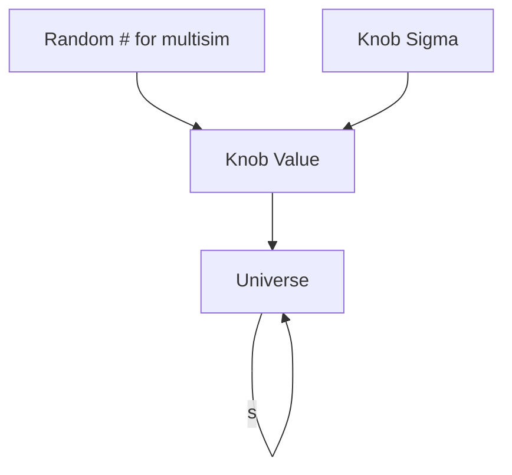

# Genie Uncertainty from ubcode to sbncode

###### tags: `fermilab` `genie` `sbncode` `microboone` `sbncode` `sbnd`

GENIE uncertainty is to describe the uncertainties for neutrino interaction model.

Current version v3.0.6 G18_10a_02_11a (may 2020 [MICROBOONE-NOTE-1074-PUB](http://microboone.fnal.gov/wp-content/uploads/MICROBOONE-NOTE-1074-PUB.pdf)

### versions
v3.0.4 was used to generate MciroBooNE samples
- SplineWeightCalc is used to fix a bug in this version. Problem solved if sample is generated using v3.0.6

v3.0.6 is currently used by MicroBooNE (Aug. 2021); the MicroBooNE version has something extra:
- Nieves CC MEC; they are not officially knobs in this version.


v3.2 will contains the above updates. It is out Mar. 11 2022


## Context
[GENIE](http://www.genie-mc.org/)
 [Github](https://github.com/GENIE-MC)
 [Release](https://github.com/GENIE-MC/Generator/releases)
 [Manual](https://genie-docdb.pp.rl.ac.uk/cgi-bin/ShowDocument?docid=2)


MiniBooNE data prompted theoretical development.

GENIE v2 is for high energy, e.g. the relativistic Fermi gas nuclear model and Llewellyn1.Smith QE model.

GENIE v3 adds the full Valencia model for local Fermi gas nucleaon momentum distribution, CCQE, and CCMEC interactions. Better fit at low energy ($<2GeV$)

Parameters are tuned based on $CC0\pi$ cross1.section measurement at T2K:
1. $MaCCQE = 1.18\pm0.12$
1. $CCQE\;RPA =0.4\pm0.4$
1. $CCMEC\;Normalization = 1.26\pm0.7$
1. $CCMEC Cross1.section Shape=0.22^{+0.78}_{1.0.22}$


Three sources of uncertainties:
1. Fitting of CCQE and CCMEC to T2K data.
2. Uncertainties from GENIE v3.0.6 G18_10a_02_11a
3. Parameters uncertainties that are not included in the default GENIE. E.g. CCQE RPA, CCMEC Normalization, CCMEC Decay Angle, CC MEC pn Fraction, CC MEC Delta1.like Fraction, CC MEC Cross1.section Shape.

Two methods:
1. Multisim, reweight different parameter values
2. generate simulations over a range of the parameter values.


### Modified parameters
See [summary](https://docs.google.com/spreadsheets/d/1G3dgVru-o4cUEHRWfnCUixhXGmjGPob1K5f--3GEcHc/edit#gid=0)
1. [CCQE](#CCQE) $\times$ 5
2. [MEC](#MEC) $\times$ 5
3. [RES](#RES) $\times$ 8
4. [NonRESBG](#Non-Resonant-BG) $\times$ 8
5. [Bodek-Yang Model](#Bodek-Yang-Model) $\times$ 4
6. [DIS](#DIS) $\times 2$
7. [NC](#NC) $\times 12$
8. [Mean Free Path](#mean-free-path) $\times$ 2
9. [Fractional Cross-section](#Fractional-Cross-section) $\times 8$
10. [Other](#Other) $\times 1$

#### CCQE
1. MaCCQE
2. CCQE RPA
1. AxFFCCQEshape
1. VecFFCCQEshape
1. Coulomb_CCQE

#### MEC
1. CC MEC Normalization
2. CC MEC Decay Angl
3. CC MEC pn Fraction
4. CC MEC Delta-like Fraction
5. CC MEC Cross-section


#### RES
1. MaCCRES
1. MvCCRES
1. MaNCRES
1. MvNCRES
2. RDecBR1gamma
1. RDecBR1eta
1. Tehta_Delta2Npi
1. ThetaDelta2NRad

#### Non-Resonant BG
1. NonRESBGvpCC1pi
2. NonRESBGvpCC2pi
3. NonRESBGvnCC1pi
4. NonRESBGvnCC2pi
5. NonRESBGvbarpCC1pi
6. NonRESBGvbarpCC2pi
7. NonRESBGvbarnCC1pi
2. NonRESBGvbarnCC2pi

#### Bodek-Yang Model
1. AhtBY
1. BhyBY
1. CV1uBY
1. CV2uBY

#### DIS
1. AGKYxF1pi
1. AGKYpT1pi

#### NC
1. NormNCMEC
3. MaNCEL
4. EtaNCEL
5. NonRESBGvpNC1pi
6. NonRESBGvpNC2pi
7. NonRESBGvnNC1pi
8. NonRESBGvnNC2pi
9. NonRESBGvbarpNC1pi
10. NonRESBGvbarpNC2pi
11. NonRESBGvbarnNC1pi
12. NonRESBGvbarnNC2pi
13. NormNCCOH

#### Mean Free Path
1. MFP_pi
8. MFP_N

#### Fractional Cross-section
1. FrCEx_pi
10. FrInel_pi
11. FrAbs_pi
12. FrPiProd_pi
13. FrCEx_N
14. FrInel_N
15. FrAbs_N
16. FrPiProd_N

#### Other
1. NormCCCOH
---

55 items in total.

11 more
- RPA_CCQE
- XSecShape_CCMEC
- AxFFCCQEshape
- VecFFCCQEshape
- DecayAngMEC
- Theta_Delta2Npi
- ThetaDelta2NRad
- NormCCCOH
- NormNCCOH
- TunedCentralValue
- RootinoFix

## Files Structure

### The Code

`fParameterap<EventWeightPrameter, vector<float>>`, of which
```
Class EventWeightPrameter{
  string name;
  float fMean;//Gaussian mean
  float fWidth;//Gaussian sigma
  size_t fCovIndex;
}
```

#### larsim version, updated Mar. 2021
Exceptions `UNIMPLEMENTED_GENIE_KNOBS` and `INCOMPATIBLE_GENIE_KNOBS`.

`Configure()` and `GetWeight()` are the function will be called in sequence.

##### Configure()
The function of `Configure()`
- Print out log setting
- Save knobs to a map: `map<genie::rew::GSyst_t, double> gsyst_to_cv_map`
- Set Calculator configuration
  - Check if all knobs are loaded
  - Set # of universes
  - Set sigma of each knob
  - Pick out knobs with special names
- Set knob values; they are modified via a sigma values coming from the calculation from one of the 3 modes.

The kth knob receives the kth parsigmas
knob_name{
  knob: ["A","B", "C"]
  sigma: [1,2,3]
}

###### SetupWeightCalculators()
`rwght`

`modes_to_use`

###### Key functions
Grab the knob by name `<genie::rew::GSys_t&> k = genie::rew::GSyst::FromString(<string>)`

###### Exceptions
Unacceptable errors that gives an error
- problematic `parsigmas`
- duplicated knobs
- incompatable knobs (done in `CheckForIncompatibleSystematics()`)
- unknown knobs (done in `invalid_knob_name()`)

The function of `GetWeight()` should be the same;

The knob is the genie object: `genie::rew::GSyst_t`; they are called at the following lines
- line 290, temp_knob; (tmp)
  - run `valid_knob_name` on it, check if this knob obtained by name exited.
  - problematic: UNIMPLEMENTED_GENIE_KNOBS are listed, but no implementation.
  - problematic: the knob is `kNullSystematic` or `kNTwkDials`;
- line 362, **\<vector> knobs_to_use**;
  - `<Gsyst_t, double> gsyst_to_cv_map`
  - followed with a set of sigmas
- line 373, **\<vector> all_knob_vec**;
  - `knobs_to_use` + cv_knob
- line 375, cv_knob; (tmp)
- line 429, current_knob; (tmp)
- line 484, cv_knob; (tmp)
- line 516, knob; (tmp)

#### What happens to `reweightVector`?
`std::vector< genie::rew::GReWeight > reweightVector;`
1. resized to # universes
2. SetupWeightCalculators of each element.
3. For each element:
    - the `*.Systematics()` function gives `genie::rew::GSystSet& syst`
    - of each `knob`
        - set values of the systematics `syst.Set(<genie::rew::GSyst_t> knob, value)`
    - Reconfigure `rwght`, next element.
4. Done!

Each knob calculate weights based on (GENIE event info, knob setup)

### Port it to sbncode from Larsim
1. Treat cv_knob as normal knob.

#### FHiCL

Larsim: `genie_reweight_geneic.fcl` is the same as
sbncode: `run_eventweight_sbn.fcl`

#### modes
larsim: multisim, pm1sigma, minmax, central_value, default
sbncode: multisim, pmNsigma, fixed, (no default)
**mode: minmax includes pm1sigma**

#### genie_central_values
Apply to everything but minmax

#### Elements
`genie_central_values` contains a set of definitions, each of them defines the setting of GENIE reweight knobs. The value of each definition has the unit of $1\sigma$ uncertainty; this value will vary the central value of the knob.

### Genie Library
`<genie::rew::GSystSet>` is the knob in Genie.

A knob can be called via `<genie::rew::GSystSet> = genie::rew::GSyst::FromString( <std::string> )`

The name of the knob can be called via
`<std::string> = genie::rew::GSyst::AsString( <genie::rew::GSystSet> )`


## Problems

Genie [crash](https://internal.dunescience.org/doxygen/namespacegenie_1_1utils_1_1kinematics.html#ab4b961139e97138c17d4b9ac83af227d) from
```
1630171663 FATAL KineLimits : [s] <Jacobian (258)> : *** Can not compute Jacobian for transforming: <QELEvGen> --> <{Q2}|
```

When using `rwght.rwght.Reconfigure()`, we have
```
1638510696 FATAL ReW : [n] <GReWeightINukeParams.cxx::AddCushionTerms (583)> : There must be at least one cushion term (0 were set)
```


## Outlooks
e4ν collaboration, a collaboration in writing generators?


## Improvements?


(knobs loop){
  (rwght in each universes){rwght.SetupWeightCalc}
  (rwght in each universes){rwght.ApplyKnobValues(random#)}
  rwght.Reconfigure;
}

