# SinglePhoton Module from ubcode to sbncode


[Mermaid reference](https://jojozhuang.github.io/tutorial/mermaid-cheat-sheet/) 
Version Nov. 2022 UBOONE_SUITE_v08_00_00_64


###### tags: `fermilab` `genie` `sbncode` `microboone` `sbncode` `sbnd`


See the code https://cdcvs.fnal.gov/redmine/projects/ubana/repository

NCDeltaRadiative Generation FHiCl at uB: `/cvmfs/uboone.opensciencegrid.org/products/uboonecode/v08_00_00_55/job/prodgenie_common_uboone_NCDeltaRadFiltered.fcl`

To make it work in sbnd, it needs..
- to update`CET_PLUGIN_PATH` by adding `DEFINE_ART_MODULE(NCRadiativeResonant)` at the end of the *.cc file

## Progress
- Wk1: Get to know how to run the code & remove package dependency
- Wk2: Get the code compiled with bunch of comments
- Wk3: Get the code runs with new FHiCL
- Wk4: Update dependency and make it compiled again
- Wk5: Update Labels and check if the code gets correct objects.
- Wk6: Some non-crsahing warnning is fine, it turns out the code needs to be upgrade to deal with multiple reconstrcuted neutrinos.
- Wk7: Investigate why there are multiple PFParticles
- Wk8: Adjustment: Only choose highest nu-score PFParticle as nu slice, check sss variables work.
- Wk9: Get a sample event display with a sss variable.
- Wk10: Get some physics from it, i.e. signal efficiency from selection
- Wk11: Stuck in NCdelta events generation
- Wk??: Now found some varaibles not working well


[Study CAF](https://sbn-docdb.fnal.gov/cgi-bin/sso/ShowDocument?docid=21432)

variables:
- `m_` global event variables - will be possibly saved, event based
- `tem_` temporary local variables
- `s_` static parameter settings - not into outputs
- `g_` global knobs to turn on/off some features

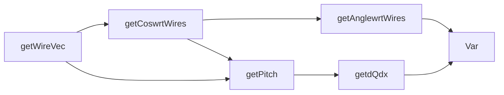


#### Testing sample of 213 events
25416/198783=12% of 1g0p NCDeltaRad events in UB
66/280=23.5% of 1g0p NCDeltaRad event in SBND

`mctruth_is_delta_radiative`

`vertex_tree->Scan("run_number:subrun_number:event_number:mctruth_nu_vertex_z:reco_asso_showers:reco_asso_tracks")`

`vertex_tree->Scan("mctruth_nu_vertex_x:mctruth_nu_vertex_y:mctruth_nu_vertex_z")`

`vertex_tree->Scan("mctruth_nu_vertex_x:mctruth_nu_vertex_y:mctruth_nu_vertex_z:reco_shower_startx:reco_shower_starty:reco_shower_startz:reco_shower_start_in_SCB","reco_asso_showers==1")`

## To do

[x]Use highes nu_score PFParticle as the vertex candidate

[x] high level overview in the meeting with Andrzej Szelc
[x] Generate NC delta radiative signal MC
[x] add `NCRadiativeResonant_module.cc` as the resonance filter.
[x] add `NCDeltaRad.cc` as the delta filter.
[x] shower objects are from mutiple neutrino slices??; (confirmed)

[x] Evaluate the delta radiative signal efficiency
    - ub:36.7% and sbnd:18.6%
[x] Check inconsistent variables: 
    <s>`reco_shower_kalman_dEdx_allplane_median`</s> (**No Kalman fitter** in SBND)
    <s>`reco_shower_start_dist_to_SCB`</s>
    <s>`sss3d_ioc_ranked_implied_opang`</s> (removed) may have too many `-9`?
    <s>`sss3d_ioc_ranked_conv` </s>too many `-9`? (May not have such object in SBND?)
    <s>`reco_shower_trackscore`</s> ~ "Shower score" peaks 0.35 but it peaks at 0 at ub? (it is different for single shower events)
   <s>`reco_shower_nuscore`</s>~"Neutrino Slice Score" peaks 0.6 , but peak around 0 & 1 in ub? (it is different for single shower events) <s>`reco_shower_dEdx_amalgamated`</s> is relatively flat? (fixed along with the fix of reco. shower energy)
    <s>`reco_shower_energy_max`</s> peaks around 1GeV (fixed by updating gain factors)
[x] Update `fiducial_volume.h` parameters
    - going to make one boundary: active volume. no SCB, no detector volume (yet).
[x] Fiducial volume contains two boxes, draw them.
 - update `reco_shower_start_dist_to_SCB` to
    `reco_shower_start_dist_to_OUTSIDE_SCB`
    and `reco_shower_start_dist_to_CathodePLane`
[x] Add quick-start guides
[] ~~Add `max_nuscore` variable~~
[] Clean up headers collection

[] Add SCB boundary varaibles (not available now);
    - Clarify what they are
[] Teach sbncode to read input files. (use the LArSoft module?)
[] Finally, make a CAF output;
[] Improvement: all variables go to the same class? e.g. shower & track variables;
[] Factor out the core module, i.e. exclude input/output sections.
[] Efficiency of the proton-stub rejection as a function of true proton energy
[] Efficiency of the second-shower rejection as a function of true photon energy
[] Proton tagging using pronton-stub clustering?
[] Add the use of light information in sbnd
[] add path-length varaibles (this gives difference to distance for a curly path)?


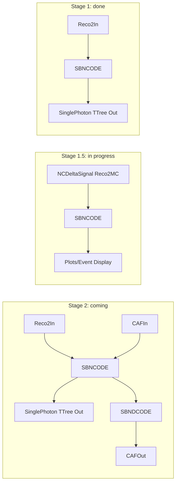

##### Fix lists:

Use `e20:debug` and `gdb` to loop through error

crash happens on one file only.

Check if Cosrsika events handled properly as Pandora info?
Did HitMCParticleAssnLabel give the correcet objects (if objects really available under sbncode)?


MCTruth particles is @ (-35.4828,-49.6321,343.847), along with following MCTruth particles

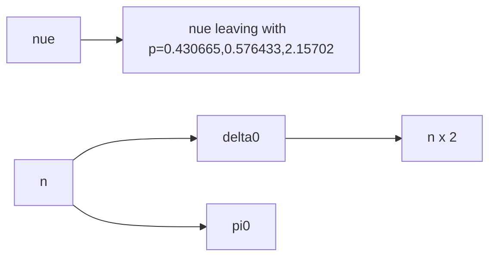
(Pandora Found Particles?)
PFParticles info. of a testing sample event:

- 112th PFParticle (slice 2) has pdg 14 (nuscore: 0.42) @ (62.7847,40.7447,5.1916)
    - Pandora Reco within slice: 1e 1mu
- 113th PFParticle (slice 0) has pdg 12 (nuscore: 0.32) @ (-170.828,-82.2647,439.528)
    - Pandora Reco within slice: 0e 2mu
- 114th PFParticle (slice 1) has pdg 12 (nuscore: 0.67) @ (-39.3226,-51.2189,347.492)
    - Pandora Reco within slice: 3e 1mu


SBND TPC: 400 x 400 x500 cm

## Where to find the ub vsersion code
```
VER=v08_00_00_431
QU=e17:prof

echo "Setup sbndcode ${VER}"
source /grid/fermiapp/products/uboone/setup_uboone.sh
setup uboonecode $VER -q $QU

source localProducts_larsoft_v08_05_00_13_e17_prof/setup
mrbsetenv

```
Checkout the `ubana` code and the branch `feature/markross_Nov2021_merge`


## sbncode features
It has CAF module as the official output.

### Preparing TTree Branches
For each variable, we preparing branches in three steps for EACH VARIABLE:
`ClearBranches`
`ResizeBranches`
`CreateBranches`

In CAF, something more generic is used:
```
  TTree* trenv = new TTree("envtree", "envtree");
  std::string key, value;
  trenv->Branch("key", &key);
  trenv->Branch("value", &value);
  for(const auto& keyval: envmap){
    key = keyval.first;
    value = keyval.second;
    trenv->Fill();
  }
  trenv->Write();
 ```

## ub SinglePhotonAnalysis Features

The code builds objects based on Pandora nu slices information.

- it matches RecoMC object to MCTruth object
- it looks for isolated shower and reconnects them to candidate vertices, using DBSCAN
- it provides different energy information across different wire planes.
- it produces readable TTree files for analysis


Input: Reco2 files;
Output: regular ROOT

ub: Reco2-->TTree
sbn: reco? --> labels for CAF


"ub reader" --> TTree as first step

Testing input:
`/pnfs/sbn/data/sbn_nd/poms_production/      MC2021Bv1/prodoverlay_corsika_cosmics_proton_genie_nu_spill_gsimple-configh-v1_tpc/reco2_caf/80/0e/reco2-8d4f2fbe-0539-4da0-87ae-b6054da21222.root`

Testing CAF input:
`/pnfs/sbn/data/sbn_nd/poms_production/MC2021Bv1/prodoverlay_corsika_cosmics_proton_genie_nu_spill_gsimple-configh-v1_tpc/reco2_caf/02/c3/reco2_caf-a552afc9-4910-49aa-80cc-174d0e23303d.root`

## Structure

#### Flows

The main flow
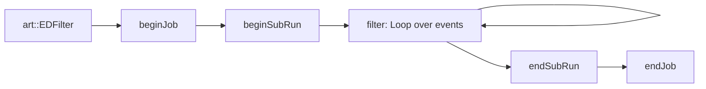

In each event loop:

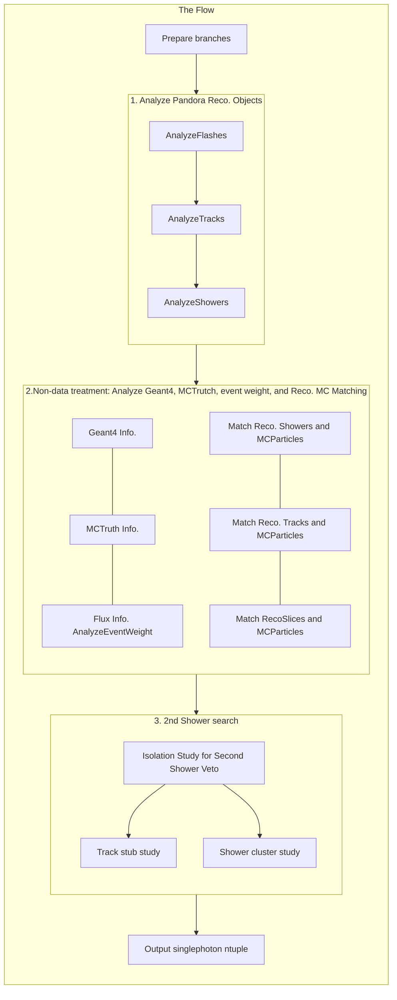

Current header structure
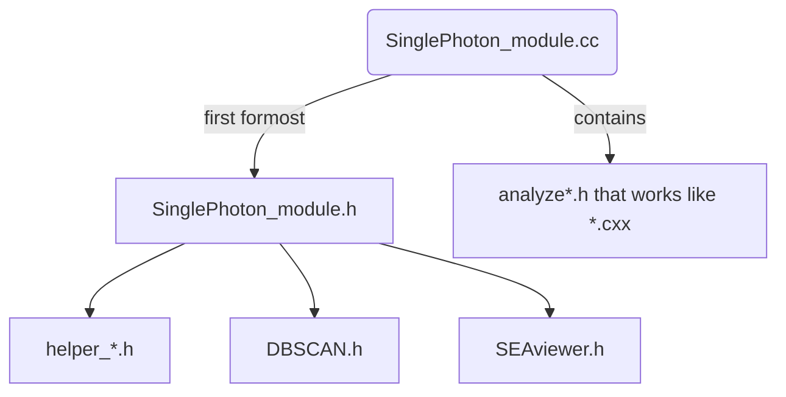

|before| after|
|---|---|
|All headers|Construct `*.cxx` - `*.h` pair|
|`SinglePhoton_module.h` has all semi-global variables as a giant class|Real global variables defined via `extern double var1`|


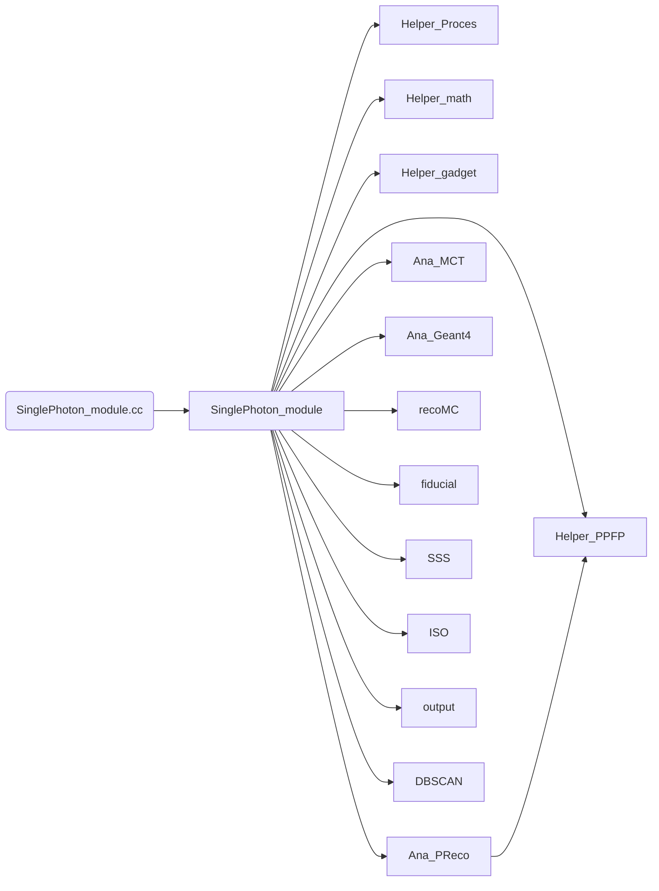


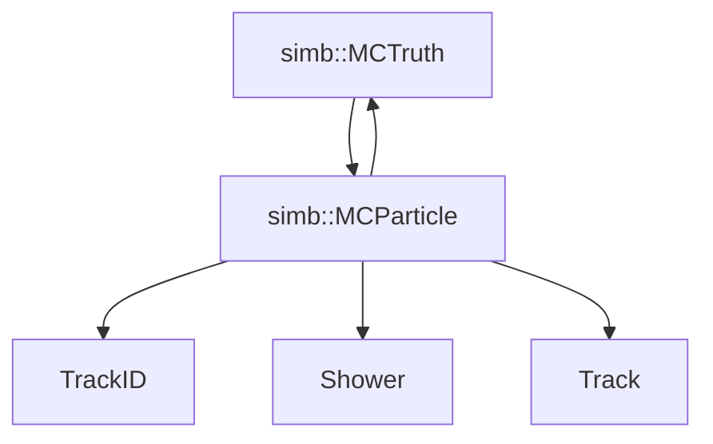

#### Files and functions of them
`SinglePhoton_module.cc` calls out the main flow and calls individual functions

`AnalyzeFlashes()` function in `analyze_OpFlash.h` collects CRT info. from `recob::OpFlash` object, then save them into `vertex_tree`.  Maybe these are prepared in CAF?


#### Items Classes
- SinglePhoton 
- cluster
- sss_score


- `isolation.h` provides functions for clearing SinglePhoton class.

##### Pandora Objects
Find a way to connect these objects?
`recob::PFParticle`
`recob::Track`
`recob::Shower`
`recob::Hit` (obtained from handle, event, labels)
`recob::Cluster`
`recob::Slice`
`simb::MCTruth`
`simb::MCParticle`
`recob::SpacePoint` (for Tracks)
`larpandoraobj::PFParticleMetadata`

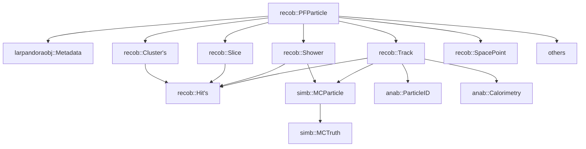

Pandora @ MicroBooNE
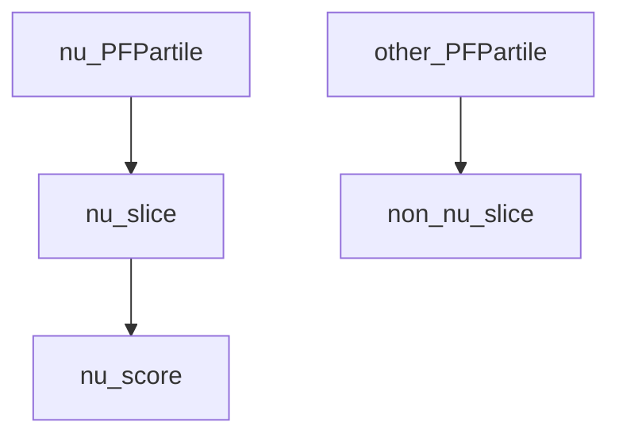

Pandora @ SBND
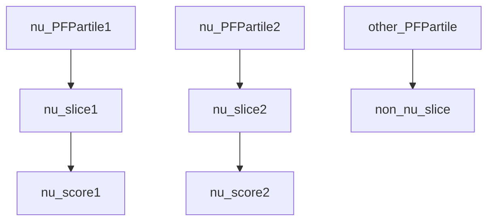


`recob::OpFlash` is not in the party (yet)

#### FHiCL Labels
Problems:
[] *pandoraSCECalo* has no assotiations to *pandoraTrack*

|Alias|Objects|Label|
|---|---|---|
|PandoraLabel|`std::vector<recob::PFParticle>`<br>`std::vector<recob::Cluster>`<br>`std::vector<recob::Slice>`<br>`std::vector<recob::Vertex>`|pandora|
|TrackLabel|`std::vector<recob::Track>`|pandoraTrack|
|ShowerLabel|`std::vector<recob::Shower>`|pandoraShower|
|ParticleIDLabel|`anab::ParticleID`(`art::FindOneP`)|pandoraSCEPid|
|CaloLabel|`anab::Calorimetry`(`art::FindManyP`)|pandoraSCECalo|
|FlashLabel|`std::vector<recob::OpFlash>`|opflashtpc0|
|POTLabel|`sumdata::POTSummary`|generator|

Below alias auto-configured by default
|Alias|Objects|Label|
|---|---|---|
|HitFinderModule|`std::vector<recob::Hit>`|gaushit|
|BadChannelLabel|`std::vector<int>`|badmasks(REMOVED)|
|ShowerTrackFitter|`art::Assns<recob::PFParticle,recob::Track,void>`|pandoraTrack|
|ShowerTrackFitterCalo|`anab::Calorimetry`(`art::FindManyP`)|pandoraCalo|
|GeneratorLabel|`std::vector<simb::GTruth>`<br>`std::vector<simb::MCTruth>`|generator|
|GeantModule|`simb::MCParticle>`(`art::FindManyP`)|largeant|
|HitMCParticleAssnLabel|`simb::MCParticle,anab::BackTrackerHitMatchingData`<br>(`art::FindManyP`)|gaushitTruthMatch|
|Shower3DLabel|`recob::Shower`(`art::FindOneP`)|pandoraShower|

Note `ShowerTrackFitter` is a shower label with objects of tracks; it was called `pandoraKalmanShower`, but this is not available in SBND, so may use `pandoraShowerSBN`?

### Labels Difference in SBND
|content|pandoraSCEShowerSBN|PandoraSCEShower|
|---|---|---|
|MinAngleToWire|2.6e-1|0|
|AngleCut|nah|1.7e-1|
and others..
see `fhicl-dump reco2_sce.fcl`

|content|pandoraShower|PandoraSCEShower|
|---|---|---|
|SCECorrectEField|false | true|
|CECorrectPitch|false | true|
|SCEInputCorrected|false | true|
 


### Parameters
`work_function` and `recombination_factor` to translate Q to E:
$$E=\dfrac{Q\times \text{m_work_function}\times 1e-6}{\text{m_recombination_factor}}$$

`gain_mc`, `gain_data` determine gains of wire planes for simualtion: $$Q=gains\times ADCs$$

In SBND, gains are defined in [sbndcode/LArSoftConfigurations/calorimetry_sbnd.fcl](https://github.com/SBNSoftware/sbndcode/blob/develop/sbndcode/LArSoftConfigurations/calorimetry_sbnd.fcl): `sbnd_calorimetryalgmc.CalAreaConstants:  [ 0.0200906, 0.0200016, 0.0201293 ]`

Or use the **box formula** at [SBN-doc-18701-v1](https://sbn-docdb.fnal.gov/cgi-bin/sso/ShowDocument?docid=18701)?

`work_function=23.6eV` as average energy needed to produce an ionization electron.

$$E=\sum_i (dE/dx)_i$$

$$dE/dx=\dfrac{dQ/dx}{W*R}$$


## Log changes:
Update member name of `DetectorPropertiesService` and `DetectorClocksService`, see [the slide 13](https://indico.fnal.gov/event/43323/contributions/185976/attachments/128392/155303/larsoft-coordination-2020-05-19.pdf)


Remove `DAQHeaderTimeUBooNE` that reads the handle `raw::DAQHeaderTimeUBooNE` by label`daq`; it needs `timeLow()` from the member `gps_time()` of the `raw::DAQHeaderTimeUBooNE` class.

Replacements:
|Old | New|
|---|---|
|`ubobj/CRT/CRTHit.hh`|`sbnobj/Common/CRT/CRTHit.hh`|


###### Todo
In sbncode `daq` label is used in `EXTRetriever_module.cc`; is is named as `raw_data_label` in `BeamSpillInfoRetriever/job/extcountinfo.fcl`.

### Random Found
`PFPParticle->Self()` is the index of the pfparticle.


## Upgrade to CAF

- Weights calculated from `GetWeight(evt, inu)` at `calculator.cxx`
- EventWeightMap at `/Base/WeightManager.cxx` return the `EventWeightMap = {name, weights}`
- `SBNEventWeight_module.cc` capture the `EventWeightMap = {name, weights}`
    - Initialize `art::Ptr<sbn::evwgh::EventWeightMap> ptr(evt)`
    - Create a `std::make_unique<std::vector<EventWeightMap> >()` and push_back the `EventWeightMap`;
    - Create a `std::make_unique<art::Assns<simb::MCTruth, sbn::evwgh::EventWeightMap> >()` and `->addSingle(Ptr<simb::MCTruth>, art::Ptr<sbn::evwgh::EventWeightMap>)`
- `evt.put(<make_unique objects>)`

