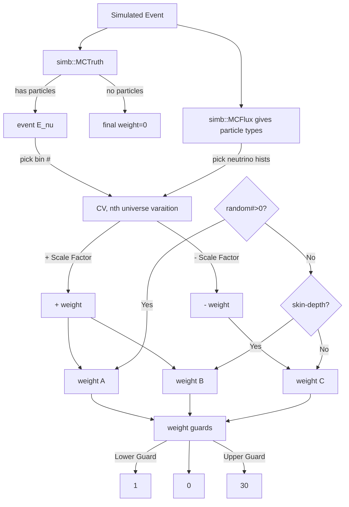
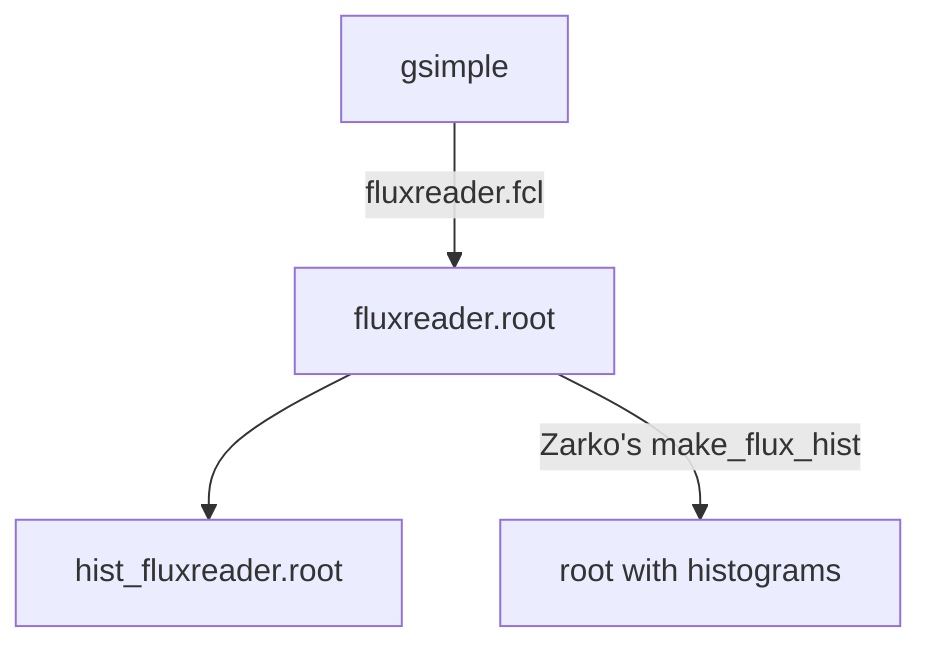

# Flux Uncertainty from ubcode to sbncode 
https://docs.google.com/spreadsheets/d/1myFci35aAzcH0PwNkW7hqrsRf6fbHWZhmkR3-DTOKho/edit#gid=1351307553

https://docs.google.com/presentation/d/10RRXxNe5WfZRbItJ8FeHvjWePwYtA8wY0Y4dPxCKTWk/edit#slide=id.ge3557c7aed_0_7
## Outlook
It is ideal to use MCFlux energy (**only**) information instead of MCTruth::Enu. But how? Matrix propagation?

Check the outcome of multi-gaussian smearing: do they really reproduce the same covariance matrix?

How often do we need to use the weight guard?

Why we choose the upper limit of weights to be 30?

## MiniBoonE Flux Event Weight
[mb dead Link](http://cdcvs0.fnal.gov/cgi-bin/public-cvs/cvsweb-public.cgi/~checkout~/miniboone/AnalysisFramework/MultisimMatrix/src/MultisimMatrix_initialise.F?rev=1.18;content-type=text%2Fplain)

[TechNote](https://microboone-docdb.fnal.gov/cgi-bin/sso/ShowDocument?docid=8622)

## What are new in MicroBooNE Flux Eventweight
Built from MiniBooNE flux eventweight, MicroBooNE flux eventweight has the following developments:
1. $p+Be\rightarrow \pi^+$: mb uses Sanford-Wang parameters, but ub uses CV from initial Sanford-Want parameterization.
2. $K^+$ production: ub corrects a miscalculation of mb code on the center of mass energy. This crosssection is estimated using Feynman scaling parameters.
3. $K^-$ production: flat normalization. ub add a guard so as to keep only positive random number.
4. $K^0_L$ production: mb uses $K_L^0$ only, but ub adds $K_S^0$. The weight calculation follows Sanford-Wang parameterization with guards on parameters. Weights are required to be positive.

## How weights are calculated
Weight Calc, loop through events;
loop through particles in an event;
loop through actual calculator under the same weight calc for each particle.

### Non-Hadronic Production, FluxUnisim

They share the same CV file; 

#### Inputs
Three universes of beam MC under `/cvmfs/uboone.opensciencegrid.org/products/uboonedata/v08_00_00_54/beamData/UnisimHists/`:
- CV
- Postive ($+1\sigma$) Variation
- Negative ($-1\sigma$) Variation

These histograms are neutrino flux as a function of the true neutrino energy (in GeV).

The code take `h5AB` histograms (True Neutrino energy spectra) and turn them into a 4x4xbins matrices, where $\{A,B\}=\{1,2,3,4\}$ represent (**For loading histogram only**):
- Initial parent of the neutrinos from the target $A=\{mu,pi,k0,k\}$
- Neutrino flavors $B=\{nue,nuebar,numu,numubar\}$

> In `GetWeight` function,
> $type = \{0,1,2,3\}$
> Flavor:$\{nue,nuebar,numu,numubar\}$
> Parent:$\{mu,pi,k0,k\}$

All types of FluxUnisims share the same CV file, (new MC reweighted to may06 CV - the MC used in MiniBoonE), 10k POT, BooBeamNT package, with parents decayed 1000 times. 

There are 8 types FluxUnisims [MicroBooNE-doc-7866](https://microboone-docdb.fnal.gov/cgi-bin/sso/ShowDocument?docid=7866):

1. **Horn current.**
Vary the current per pulse: $174\pm 1kA$
2. **Skin depth** in horn.
Only one variation (same for positive and negative), with/without current penetration.
4. **Pion inelastic XS**
6. **Pion QE XS**
7. **Pion total XS**
8. **Nucleon inelastic XS**
9. **Nucleon QE XS**
10. **Nucleon total XS**
Pion and Nucleon variation comes from the secondary interaction uncertainties; they vary the $Be(Al)$ cross section as the following:

|Particles\Type|TotalXS|INEXS|QEXS|
|---|---|---|---|
|Nucleon|$\pm15(\pm25)$|$\pm5(\pm10)$|$\pm20(\pm45)$|
|Pion|$\pm11.9(\pm28.7)$|$\pm10(\pm20)$|$\pm11.2(\pm25.9)$|

#### Calculation
[Flow chart tutorial](https://mermaid-js.github.io/mermaid/#/flowchart)
*Work on spectra with 50MeV bin width.*

##### Formulas for the above evluation.
Of a universe, 
$\pm Weight=(\pm SF)*(Variation+[1- (\pm SF)]*CV$

where $(\pm SF)$ means $(\pm$ Scale Factor).

The final weights, A, B, and C: 
$w_A=1+R_n(\dfrac{+Weight}{CV}-1)$

$w_B=1-R_n[2-(\dfrac{+Weight}{CV}-1)]$

$w_C=1-R_n(\dfrac{-Weight}{CV}-1)$

where $R_n$ is the random number for the nth universe.

Lower Guard
- $\pm Weight ==0$
- $CV<1e^{-12}$
- $w<0$ 
- nue from muon or pion
- numu from pion or charged kaon

Upper Guard
- $w>30$

---
### Hadronic Production

Now random variations depend on correlated parameters and uncertainties, i.e. using covariance matrices.

Four types.
- $K^-$ uses flat normalization
- $\pi^\pm$ uses SW Central Spline Variation
- $K^+$ uses Feynman Scaling
- $K^0$ uses Sanford Wang weights

#### Normalization

Draw a random number from a Gaussian distribution with $\mu=0,\sigma=1$.

Take the weight as $(1+random\#)$.

For negative weight, set it to $0$.

#### SanfordWang 
Differential cross section using Sanford-Wang parameterization:
$\dfrac{d^2\sigma}{dpd\Omega}
=c_1p_K^{c_2}(1-\dfrac{p_K}{p_p-c_9})\exp(-c_3\dfrac{p_K^{c_4}}{p_p^{c_5}})
\exp[-c_6\theta_K(p_K-c_7p_K\cos(\theta_K)^{c_8})]$

- MC Flux provide hadron ($K^0$) 4-momentum
- Proton is assumed going along z-direction with 8.89GeV momentum.
- CV cross-section is extracted from uBooNE BNBext data.
- Variation comes from randomized $c_n$ variables that preserve the correlation provided by uBooNE BNBext data.
- The weight is the ratio of the cross-section.

##### Weight Guards
For the CV measurement, 
- The weight is 1 (i.e. 0 cross-section), if
    - $\dfrac{p_K}{p_p-c_9}>1$; MCFlux kinematics leads to unphysical result (negative cross-section).

For the variation measurement,
- Use next set of random numbers for negative cross-section, i.e. if 
    - random numbers give $c_1<0,c_3<0$, or $c_6<0$.
- Set to 0 (i.e. 0 cross-section), if
    - $\dfrac{p_K}{p_p-c_9^{smeared}}>1$; MCFlux kinematics leads to unphysical result (negative cross-section).
- Set to 30 if 
    - final weights $> 30$.

#### SWCentral Spline Variation

It is for charged pions, $\pi ^\pm$. It comes from $8.89GeV$ proton striking a beryllium target and produce charged pion of a given momentum and angle.

1. Use SanfordWang parameterized cross section. The evaluation is done at charged pion momentum and angle of interest.
3. Use the splined smeared HARP cross section. 

##### Weight Guard
Set to $1$.
- RW or CV $<0$
- $\dfrac{p_\pi}{p_p-c_9}>1$

Upper Guard
- $w>30$

#### Feynman Scaling
It is for $K^+$. 

- Randomize $c_1,...,c_7$.
- Weight is a function of $p,c_n$

The differential cross-section of $K^+$ under Feynman scaling parametrization is:
$\dfrac{d^2\sigma}{dpd\Omega}=c_1*\dfrac{p^2}{E}
\exp(-c_3|x_F|^{c_4}-c_7|p_Tx_F|^{c_6}-c_2P_T-c_5p_T^2)$

$x_F=\dfrac{p_\parallel^{CM}}{p_\parallel^{CMmax}}=\dfrac{\text{Center of mass parallel momentum}}{\text{Threshold maximum center of mass parallel momentum}}$

$p$ is Kaon momentum and $E$ is Kaon energy

Two sets of $c_n$, one is randomized; the other is extracted from a prepared matrix. This matrix is from BNB External data.

where $P_T$ is the transved component of the momentum, $x_F$ is the Feynman scaling parameter.

##### Weight Guard

Invalid weight, use another random number
- weight < 0
- $|x_F|>1$
- RW = 0

Lower guard gives $1$
- CV $\leq 0$

Upper guard
- $w>30$

---

## How to do validation
### Plan C 
- Produce ub flux uncertainty & sbn flux uncertainty on the same gsimple file.
- Make histogram and check a few variations

### Plan B
- Produce ub flux uncertainty plots
- Produce sbn flux uncertainty plots

Steps of making plots:
- Locate gsimple files
    - `/pnfs/uboone/persistent/uboonebeam/bnb_gsimple/bnb_gsimple_fluxes_01.09.2019_463/`
    - sample file in this directory `converted_beammc_wincorr_0000.root`
- Run FluxReader, and use it to call Eventweight module
    - To set up FluxReader, just copy over those 3 directories in `/uboone/app/users/zarko/work/fluxreader_2021Feb/`
see `/uboone/app/users/klin/ubflux_2_sbnflux/ubFluxReader/srcs/larsim/larsim/FluxReader/job
` for the FHiCL file.
- Plot histogram on the output

### Plan A
- Check the event dump to quickly see what is in art-root
- use CAF in sbncode to make n-tuple root

### Documents location
ubgsimple example (USE THIS!)
`/pnfs/uboone/persistent/uboonebeam/bnb_gsimple/bnb_gsimple_fluxes_01.09.2019_463/converted_beammc_wincorr_0000.root`

ubFlux Reader
`/uboone/app/users/klin/ubflux_2_sbnflux/ubFluxReader/srcs/larsim/larsim/FluxReader/job/keng_fluxreader_evwgh.fcl`

ubEventWeight
`/uboone/app/users/klin/ubflux_2_sbnflux/ubcode/srcs/ubsim/ubsim/EventWeight/jobs/run_eventweight_microboone.fcl`

sbnFlux Reader
`/uboone/app/users/klin/ubflux_2_sbnflux/sbncode_tmp2/srcs/sbncode/sbncode/FluxReader/job/keng_run_fluxreader_sbnd.fcl`

---
Merge these:

sbnFluxEventWeight
`/uboone/app/users/klin/ubflux_2_sbnflux/sbncode_tmp2/srcs/sbncode/sbncode/SBNEventWeight/jobs/run_eventweight_sbnd_fluxKeng.fcl`

to 
sbnFlux Reader
`/uboone/app/users/klin/ubflux_2_sbnflux/sbncode_tmp2/srcs/sbncode/sbncode/FluxReader/job/keng_run_fluxreader_sbnd.fcl`

removed filter version:
`/uboone/app/users/klin/ubflux_2_sbnflux/sbncode_tmp2/srcs/sbncode/sbncode/FluxReader/job/keng_run_fluxreader_sbnd_nofilter.fcl`

---
Eventually we will have a bunch of histograms with CV & weights as the following:
`/pnfs/uboone/scratch/users/klin/ubfluxreader/v09_15_00/out/22251258_0/fluxreader_20210716T1647380.root`

sbndgsimple example
`/cvmfs/sbnd.osgstorage.org/pnfs/fnal.gov/usr/sbnd/persistent/stash/fluxFiles/bnb/BooNEtoGSimple/configH-v1/march2021/neutrinoMode/gsimple_bnb_neutrino_sbnd_v2_20210322_0000.root`

SBND Histograms no filter:
`hEnumu_cv->Draw()` gives 356420

UB Histograms no filter:
`hEnumu_cv->Draw()` gives 356420

## How to use SBN Flux Eventweight

### The Inputs
What do we need?

- Beam data histograms
- MCFlux
- MCTruth

## Side Notes

### Types of ROOTs
- n-tuples that is convenient to access variables
- gsimple that only contain beam simulation (no interactions)
- art-root that allow all sort of information accessible by LArSoft

